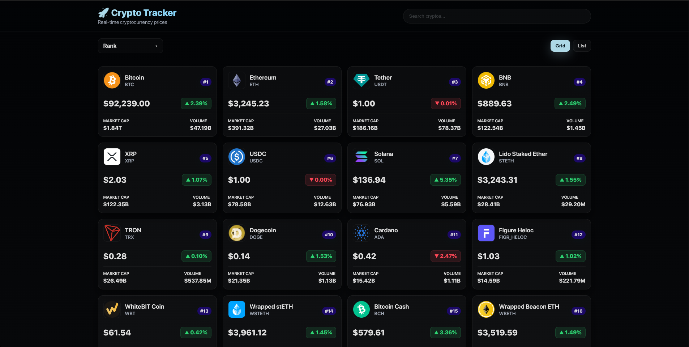
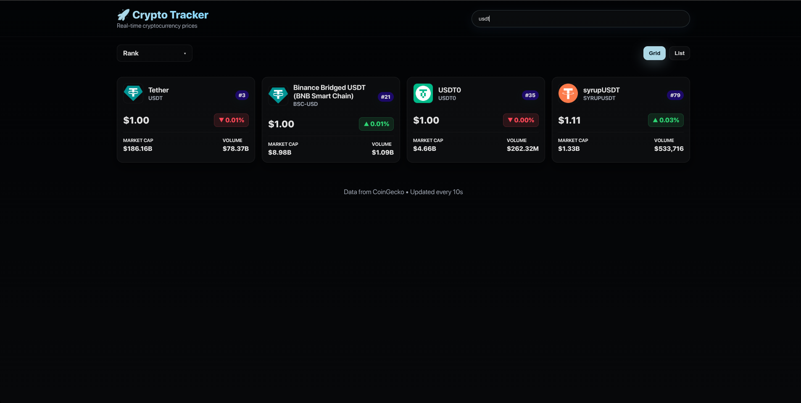
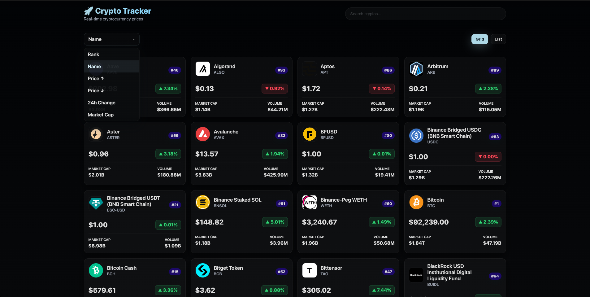
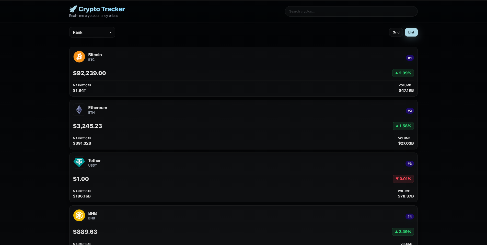
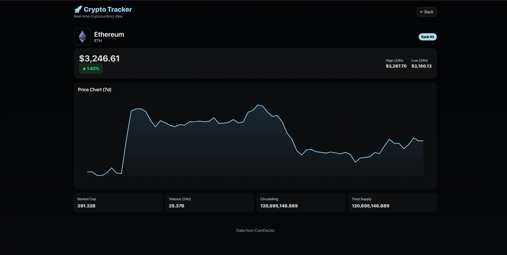
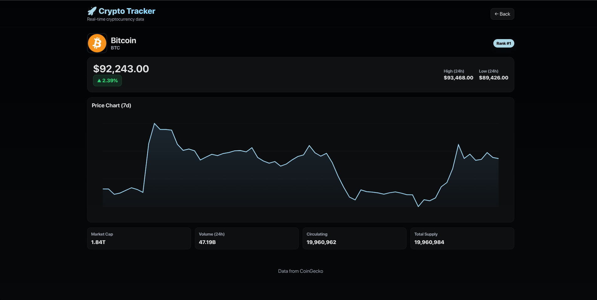

# 🚀 Crypto Tracker – Minimal Glass UI (No Frameworks, Pure JS)

A lightweight, fast, and fully responsive cryptocurrency tracker built entirely with **HTML**, **CSS**, and **Vanilla JavaScript**, powered by the **CoinGecko API**. No React, no backend, no heavy frameworks. Just clean design, smooth interactions, and reliable data fetching.

Live Demo → **[https://bishwajit-2810.github.io/CryptoTrackerBasic/](https://bishwajit-2810.github.io/CryptoTrackerBasic/)**

---

## 🌐 Features

* 🔍 **Instant Search** — filters results as you type.
* ↕️ **Powerful Sorting** — Rank, Name, Price, Change, Market Cap.
* 🟦 **Grid / List View Toggle** — two browsing modes.
* 📈 **Beautiful 7-Day Price Chart** — rendered with raw Canvas API.
* ⚡ **Auto-Refresh** every 10 seconds.
* 💎 **Glassmorphism UI** — crisp, modern, minimal.
* 📱 **Fully Responsive** — mobile-optimized layouts.
* 🔄 **CORS-Proxy Fallback** — ensures CoinGecko works even when blocked.
* 🧭 **Smooth Navigation** — Home → Coin Details.

---

## 📸 Screenshots

Below are some UI previews from the project.

### 🏠 Home Page

A clean dashboard of the top cryptocurrencies.



---

### 🔍 Search Bar

Live filtering across all crypto names and symbols.



---

### ↕️ Sorting Dropdown

Sort by multiple metrics with a custom dropdown design.



---

### 📋 List View

Compact layout for data-focused browsing.



---

### 💰 Coin Detail Page

Overview of the selected coin with price change, stats, and chart.



---

### 📈 Coin Chart

A smooth, canvas-rendered 7-day price chart.



---

## 🗂 Project Structure

```
.
├── assets
│   ├── api
│   │   └── coinGecko.js
│   ├── coin.js
│   ├── components
│   │   └── cryptoCards.js
│   ├── home.js
│   └── styles.css
├── coin.html
├── index.html
├── readme
│   ├── coin2.png
│   ├── coin.png
│   ├── home.png
│   ├── list.png
│   ├── search.png
│   └── sort.png
├── README.md
└── utils
    └── formatter.js
```

---

## ⚙️ How It Works

### 1. Fetch cryptocurrency data

Using CoinGecko's `/markets` endpoint with proxy fallbacks.

### 2. Render using pure DOM manipulation

Cards, stats, and layout are built using modular JavaScript.

### 3. Coin detail view

* Fetch coin stats
* Fetch 7-day chart data
* Render the chart manually using the Canvas 2D API
* Redraw automatically on resize

---

## 🛠 Technologies Used

* **HTML5**
* **CSS3 (Glass UI + Responsive Design)**
* **Vanilla JavaScript (ES Modules)**
* **CoinGecko API**
* **Canvas 2D Chart Rendering**

---

## 🧪 Running Locally

Clone the repository:

```bash
git clone https://github.com/bishwajit-2810/CryptoTrackerBasic.git
cd CryptoTrackerBasic
```

Run with a simple static server:

```bash
npx serve
# or
python3 -m http.server
```

Open in browser:

```
http://localhost:5000
```

---

## ✔️ Future Enhancements

* ⭐ Watchlist system
* ⭐ Multi-currency support
* ⭐ Light/Dark theme switch
* ⭐ Additional chart ranges (24h, 30d, 1y)
* ⭐ Convert into a PWA

---

## ❤️ Credits

* Designed & Developed by **Bishwajit Chakraborty**
* Data provided by **CoinGecko API**

---

